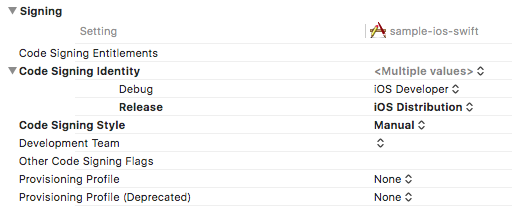

# Sample for iOS (Swift)

This is the sample continuous integrated project for iOS (Swift).

## What is this repository?

- **Test**
  - **XCTest**: (Only execute sample test code.)
- **Lint**
  - **SwiftLint**: Enforce Swift style and conventions.
- **Manage dependencies**
  - **Carthage**: Main dependencies manager.
  - **Cocoapods**: If the library is not supported by Carthage, use Cocoapods.
- **Build**
  - **fastlane**: Build and Deploy.
  - **Manual signing**: Using `.p12` file / `.mobileprovision` file. (Don't use [match](https://docs.fastlane.tools/actions/match/))
- **CircleCI**: Lint, Test, and Build in [CircleCI](https://circleci.com/).
- **PR Comment by Danger**: [Danger](http://danger.systems/ruby/) configuration is included. Lint error comes as PR comment.

## How to setup

1. Share schemes.
2. Install some app to your mac.
    - SwiftLint by `brew install swiftlint`.
    - Carthage by `brew install carthage`.
3. Copy or refer to below files. [diff](https://github.com/noboru-i/sample-ios-swift/compare/195bec4bd798f9f3077f1f1ec6a481401cda1906...master)
    - `.circleci/config.yml`
    - `.gitignore`
    - `.swiftlint.yml`
    - `Cartfile`
    - `Dangerfile`
    - `Gemfile`
    - `Podfile`
    - `certificates`: put `.p12` and `.mobileprovision` as your certificates. (If you can use `match`, please use `match`.)
    - `fastlane`: `Fastfile` has your build process. If you want to split config, please create you needed.
4. Set environment variable to CircleCI.
    - `DANGER_GITHUB_API_TOKEN` : token for check bot
    - `IOS_CERTIFICATES_KEY_PASSWORD` : password for p12 file

## Memo

### How to update Carthage dependencies

1. Put library into `Cartfile`.
2. Run `carthage update --platform iOS --no-use-binaries --cache-builds`.
3. Put `.framework` to your Xcode project.
4. Push `Carthage/Build`, `Cartfile.resolved`.

(If you don't apply `--no-use-binaries`, some library create `Mac`, `tvOS`, `watchOS` directory in `Carthage/Build`.
We don't want to include that to repository.)

### Signing setting

**If you can use [match](https://docs.fastlane.tools/actions/match/) in your team, please use `match`.**

If you cannot use `match`, we need to use `.p12` file and `.mobileprovision` file.

In this sample, store certificates to repository.

And change build setting like below,

If you had error when building, please refer to [fastlane's doc](https://docs.fastlane.tools/codesigning/getting-started/#using-xcodes-code-signing-feature).

### Include `Pods` directory to repository

https://guides.cocoapods.org/using/using-cocoapods.html#should-i-check-the-pods-directory-into-source-control

I want to reduce build time in CircleCI.

### Include `Carthage/Build` directory to repository

- https://github.com/Carthage/Carthage/blob/master/Documentation/Artifacts.md
- https://qiita.com/mono0926/items/636819c42e96a8c4e12d (Japanese)

I want to reduce build time in CircleCI.

But if you use too many/large libraries, you may ignore `Carthage/Build` from repository.

### Bitcode

In this project, I disable bitcode.

Because we usually create only iOS app.
And some library not support bitcode.

## Customize

This repository is targeting for very simple project.

But in real world, we need to work for complex project.

We have some advice for customizing configuration in [Wiki](https://github.com/noboru-i/sample-ios-swift/wiki).
Please refer to it.
